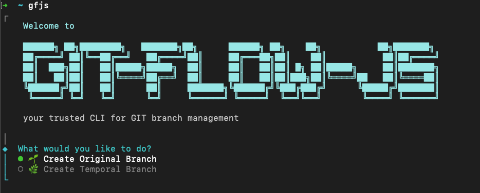

# 📦 git-flow-js

`git-flow-js` es una herramienta CLI que simplifica la gestión de ramas en Git. Automatiza flujos de trabajo comunes y mantiene una estructura de ramas consistente.

[](https://www.npmjs.com/package/git-flow-js)
[](https://opensource.org/licenses/MIT)
[](https://github.com/jaime00/git-flow-js/stargazers)

---

## 🚀 Instalación

Instálalo globalmente con npm:

```bash
npm install -g git-flow-js
````

O clónalo y enlázalo localmente para desarrollo:

```bash
git clone https://github.com/jaime00/git-flow-js.git
cd git-flow-js
npm install
npm link
```

---

## ⚙️ Uso

Ejecuta el comando principal desde la raíz de tu repositorio Git:

```bash
git-flow-js
```
o

```bash
gfjs
```



---

## 🧰 Comandos Disponibles

| Comando                      | Descripción                                       |
| ---------------------------- | ------------------------------------------------- |
| `git-flow-js`, `gfjs`                | Ejecuta el flujo interactivo para gestionar ramas |
| `-version`, `-v`            | Muestra la versión instalada                      |
| `-help`, `-h` *(en construcción 🚧)* | Muestra ayuda o información de uso                |

---

## 📁 Estructura Interna del Proyecto

Algunos comandos pueden apoyarse en los siguientes archivos y carpetas:

```
git-flow-js/
├── index.js
├── actions/
│   ├── createOriginalBranch.js
│   ├── createTemporalBranch.js
│   └── createBranchName.js
├── getters/
│   ├── getCurrentPackageVersion.js
│   ├── getBranchType.js
│   ├── getTicketOfJIRA.js
│   ├── getEnviroment.js
│   └── getCurrentBranch.js
├── utils/
│   └── validateTicketOfJIRA.js
├── README.md
├── package.json
├── .gitignore
└── .git/
```

---

## 🛠️ Contribuir

¡Contribuciones bienvenidas! Para comenzar:

```bash
git clone https://github.com/jaime00/git-flow-js.git
cd git-flow-js
npm install
npm link
```

Por favor, abre un [issue](https://github.com/jaime00/git-flow-js/issues) para reportar bugs o sugerir mejoras.

---

## 📝 Licencia

Distribuido bajo la licencia [MIT](LICENSE).

---

## 📬 Contacto

- 🌐 **Portfolio**: [Visita mi sitio web](https://jaime00portfolio.netlify.app/)
- 💼 **LinkedIn**: [linkedin.com/in/jaime00](https://www.linkedin.com/in/jaime00)
- 📧 **Email**: [imjaimetorresv@gmail.com](mailto:tu-email@ejemplo.com)
- 🐙 **GitHub**: [github.com/jaime00](https://github.com/jaime00)

Para contribuciones, reporte de bugs o sugerencias, por favor abre un [issue](https://github.com/jaime00/git-flow-js/issues) en el repositorio.

---
